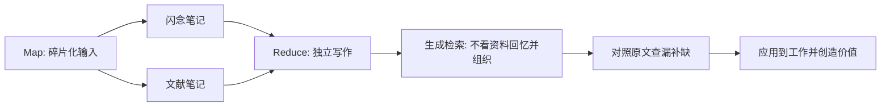
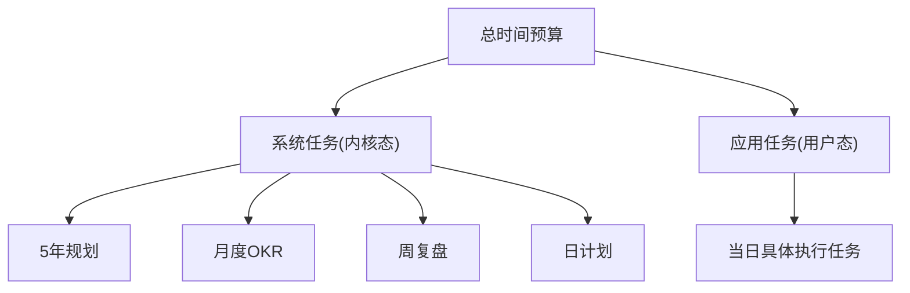

# AI-Infra (人工智能基础设施) 学习方法论

> 目标：把 AI-Infra 的学习路径从“零散资料堆积”整理为“可执行路线图”。

## 第一部分：AI-Infra 是什么，为什么学

### 1. 核心定义

`AI-Infra = 机器学习系统（模型工程）+ 支持 AI 业务的基础设施`

- 基础设施：大数据组件、异构数据库、特征处理组件等。
- 核心职责：模型表达、训练、存储、推理、运维。
- 最终形态：与数据采集/处理/补偿能力结合，支撑 AI 产品落地。

### 2. 技术实现逻辑

- 抽象链路：`Python 定义模型 -> DAG 计算图 -> C++/高性能运行时`。
- 关键组件：
  - 编译系统：将 Python 模型编译为计算图并做图优化。
  - 计算图解释器/执行器：用于训练与推理。
  - 存储机制：支持大模型、在线学习、实时更新。
  - 分布式集群控制：调度、容错、扩缩容。
  - 算子抽象：在算子粒度与性能之间做权衡。

### 3. 为什么学习 AI-Infra

- 组织价值：大厂核心中台能力，技术与业务高度耦合。
- 工程价值：它决定算法从“可用”到“可规模化落地”的上限。
- 经济价值：AI 降低交易成本并催生新需求，反向推动基建复杂度提升。
- 终极目标：让 AI 技术大规模落地，并在异构硬件上持续压榨性能与成本效率。

## 第二部分：Step 1 前置基础（阻塞 vs 非阻塞）

> 建议至少投入 300 小时高质量学习时间。阻塞项优先，非阻塞项并行。

| 模块 | 属性 | 推荐课程/资源 | 关键说明 |
| --- | --- | --- | --- |
| 数学基础 | 非阻塞 | Mathematics for Machine Learning | 以本书为主线持续学习即可。 |
| 操作系统 | 阻塞 | NJU OS（必学）+ UCB CS162（可选）+ MIT 6.828（可选） | 约 500 小时。建议完成后再进入下一阶段。 |
| 编程基础 | 阻塞 | CS106L（C++，必学） | 约 20 小时。重点是 C++ 基础与工程习惯。 |
| 分布式系统 | 阻塞 | CS149（并行计算，必学）+ MIT 6.824（可选） | 约 300 小时。并行计算是核心。 |
| 数据处理 | 非阻塞 | Data8 + Data100 | 约 100 小时。用于构建数据直觉。 |

- 阻塞：未完成前，不建议进入后续高阶模块。
- 非阻塞：可与阻塞项并行推进。
- 在职学习策略：先做和当前工作最相关的部分，再回补全量知识。

## 第三部分：Step 2 ML System 学习框架（工具性 vs 目的性）

### 1. 学习类型划分

| 类型 | 目标 | 核心价值 | 局限 |
| --- | --- | --- | --- |
| 工具性学习（Instrumental） | 提升做事正确性与效率，解决具体工程问题 | 区分行内人和行外人的主要标准 | 只能保证“正确地做事”，不一定“做正确的事” |
| 目的性学习（Purposeful） | 提升判断力与路线选择能力 | 区分资深行内人的分水岭 | 难以课程化，必须在真实问题中训练 |

### 2. 工具性学习能力矩阵（参考图表重排）

| 模块 | 能力模型 | 基础（超越外行） | 进阶（超越内行） |
| --- | --- | --- | --- |
| 机器学习 | - 能手推神经网络（含常见复杂网络）公式 - 能解释常见机器学习算法原理 - 至少掌握一个业务方向的经典模型结构 - 能估算模型内存/显存占用、计算量、通信量 | 1. 李宏毅机器学习（21/22） 2. 李宏毅机器学习 2024 3. 吴恩达机器学习 4. 吴恩达深度学习 | 1. 林轩田《机器学习基石》 2. 林轩田《机器学习技法》 3. 《统计学习方法（第 2 版）》 4. 《深度学习》 5. Mathematics for Machine Learning |
| 模型表达 | - 能使用 TensorFlow（Estimator/Keras API）构建、训练、导出、应用模型 - 能使用 PyTorch 完成同类流程 - 可了解 PaddlePaddle | 1. PyTorch-Chinese / pytorch-examples 2. Keras 3 API 文档 / Keras examples / Estimator 教程 3. 《机器学习算法竞赛实战》 | 1. Kaggle 大数据竞赛 2. 阿里天池大赛 3. 发表论文及技术专利 4. 落地 SOTA 论文并拿到业务收益 |
| 模型训练 | - 熟悉 TensorFlow / PyTorch / Megatron-LM / DeepSpeed 等框架原理与源码 - 可部署/运维大规模分布式训练集群 - 可调试/调优超大规模训练任务 - 具备改进训练引擎能力（多快好省） - 深入理解在线/离线/流式训练场景 | 1. 训练框架源码阅读（TF/PyTorch/Megatron-LM/DeepSpeed/JAX） 2. 分布式系统（HDFS/Spark/Flink/Ray/K8S） 3. 分布式计算（模型并行/数据并行/异步/多机多卡） 4. 模型优化（压缩/蒸馏/量化/剪枝/低秩分解/参数共享） 5. 机器学习范式（深度学习/强化学习/迁移学习） | 1. 在开源社区持续提交核心 PR 2. 在工业级超大任务中沉淀调试调优方法论 3. 自主设计并实现训练引擎核心模块 4. 跟进并落地最新训练范式 |
| 模型导出 | - 理解不同模型存储/传输格式差异与优化空间 - 熟悉格式转换原理并可手写实现 - 能改进模型存储/传输系统 | 1. SaveModel / ONNX / PTH 结构分析与转换工具 2. 理解 PS 架构与源码，可手写简化版项目 3. 阅读 BytePS / XDL-PS 源码并设计平台化模型存储 | 1. 在实际业务中建立统一模型格式规范 2. 建设跨框架导出与回滚机制 |
| 模型部署 | - 理解模型分发/部署流程与原理 - 能基于业务痛点改进流程与性能 - 对跨平台、多端部署有技术储备 | 1. BeeGFS / P2P 分发 / HDFS 文件系统 2. Docker / K8S / SRE / 云原生基础流程 3. 模型分发速度与稳定性优化方案 4. 流式更新/在线训练场景下的部署方案 | 1. 设计统一发布平台（灰度、回滚、可观测） 2. 形成可复用部署模板并跨团队推广 |
| 模型推理 | - 对模型应用的性能/成本/稳定性/效果负责 - 能通过分布式系统、服务端编程、图编译、算子开发改进推理系统 - 具备异构硬件与大规模场景下的推理系统建设能力 | 1. 异构硬件：GPU 架构演进 / NVIDIA 公开课 / FPGA + ML 2. 异构计算：CUDA 编程基础与实践 3. AI 编译器：MLIR / Triton-lang / TVM / XLA / TensorRT / OpenAI Triton 4. 推理框架：TF / PyTorch / ONNX Runtime / TensorRT-LLM 5. 推理服务：TFServing / Triton / Ray Serve / vLLM | 1. 跟进并落地最新推理范式 2. 在性能/成本/稳定性约束下持续追求技术先进性 |
| 模型运维 | - 为中心化部署模型提供持续运维能力 - 掌握参数搬运（全量/流式）、迁移、扩容、回滚、预案 - 熟悉模型 SRE Pipeline 工具链并具备自动化容灾建设能力 | 1. 谷歌 SRE 学习社区 2. MLOps Zoomcamp 3. Machine Learning Operations（MLOps）相关资料 4. 机器学习系统工程实践 5. MLOps 学习清单 | 1. 建设统一控制面并实现自动化故障处置 2. 推动模型运维平台化、标准化 |

### 3. 目的性学习能力矩阵（参考图表重排）

| 模块 | 能力模型 | 基础（超越外行） | 进阶（超越内行） |
| --- | --- | --- | --- |
| 业务场景 | - 至少精通一种主流 AI 业务（搜索/广告/推荐/CV/大模型/AI 工具链）的端到端构建原理 - 能识别业务瓶颈并用技术手段突破 - 能用“创业者视角”看技术投入产出 - 能判断技术变更引发的用户行为变化 | 1. 搜广推用增相关业界分享资料 2. 工业界推荐算法实践资料（含开源） 3. 阿里巴巴算法框架资料 4. 系统理解本公司上下游全链路 5. 可信线上实验与实验设计分析 | 1. 产品：豆瓣热门 Top10 2. 影响力：《从为什么开始》 3. 营销：《你的顾客需要一个好故事》 4. 事上练：《精益创业》 5. 团队：《团队协作的五大障碍》 |
| 技术视野 | - 结合学界前沿与产业最佳实践，主动规划新增长点并落地 - 具备跨学科迁移能力，把外部方法迁移到本领域 | 1. 跟踪近 3-5 年论文与 AI 科研工具 2. 关注 GitHub 趋势榜 3. 关注非 CS/AI 学科进展 | 1. 用写作促进跨学科学习（卡片笔记法） 2. 构建可复用的个人知识生产系统 |
| 判断力 | - 主动设计技术路线并决策资源投入方向 - 对技术变化保持独立判断并可做合理推断 - 抓关键问题，以最小成本解决最大问题（ROI 最大化） - 持续训练批判性思维与反共识思维 | 1. 规划半年技术路线并按认知升级持续调整 2. 参与关键问题讨论并输出技术判断 3. 大量训练“做判断并承担后果”的能力 4. 《学会提问》《金字塔原理》《判断力》 | 1. 在高不确定场景中持续输出高质量决策 2. 形成可传承的团队判断方法论 |
| 领导力 | - 强化带人做事能力，让团队愿意并能把事情做成 - 整合自身与他人产出，解决更大范围问题 | 1. 技术领导力：技术管理课程、《知行：技术人的管理之路（第 2 版）》、大厂晋升指南 2. 通用领导力：《毛泽东选集》《系统之美》《高效能人士的七个习惯》 | 1. 建立团队作战机制与人才梯队 2. 在复杂系统中稳定交付跨团队成果 |

## 第四部分：Step 3 如何完成学习（方法论）

### 1. 核心误区与原则

- 误区：把“体系化学习”当成资料收集，最后只记忆不落地，形成“学了=会了”的错觉。
- 原则：学习与工作统一，用真实问题倒逼理解深度。
- 目标：统一“目的性学习 + 工具性学习”，统一“碎片化输入 + 体系化输出”。

### 2. 现实挑战

- 效率悖论：工作追求快，学习追求透，同时做会拉低短期效率。
- 碎片化：没有连续时间，导致难以深度思考。

### 3. 解决方法：Map-Reduce 学习法

执行要点：

1. Map 阶段：利用碎片时间阅读并记录笔记（闪念 + 文献理解）。
2. Reduce 阶段：在完整时间块内做“纯独立写作”。
3. 写作时不查资料，强制回忆并建立知识连接。
4. 写完后再对照原文补齐漏洞，形成可复用输出。

## 第五部分：Step 4 时间从哪里来（时间管理）

### 1. 第一性原理

- 快速完成必要的事。

### 2. 主要矛盾

- 局部 vs 整体：局部完美主义会拖垮整体目标。
- 风险 vs 时间：项目越复杂，尾部风险越大。

### 3. 解决方法：OS 分时复用

- 系统任务（内核态）：维护长期收益，做路线、目标、复盘、节奏。
- 应用任务（用户态）：执行当天具体工作。

### 4. 关键原则

1. 持续提升判断力：规划本质是“做正确的事”。
2. 慢思考，快行动：设计阶段深思，执行阶段迅速。
3. 仅做必要的事：不能推迟、不能转移、不能放弃的事优先。
4. 跳出局部：为任务设置默认 TTL，超时即决策“继续 or 止损”。

---

## 附：可执行学习节奏（建议）

- 每周：`3 次工具性学习 + 1 次目的性写作 + 1 次周复盘`。
- 每月：复盘“能力矩阵”中 1 个模块，至少产出 1 篇可复用文档。
- 每季度：围绕一个真实业务目标，完成一次从学习到落地的闭环。
